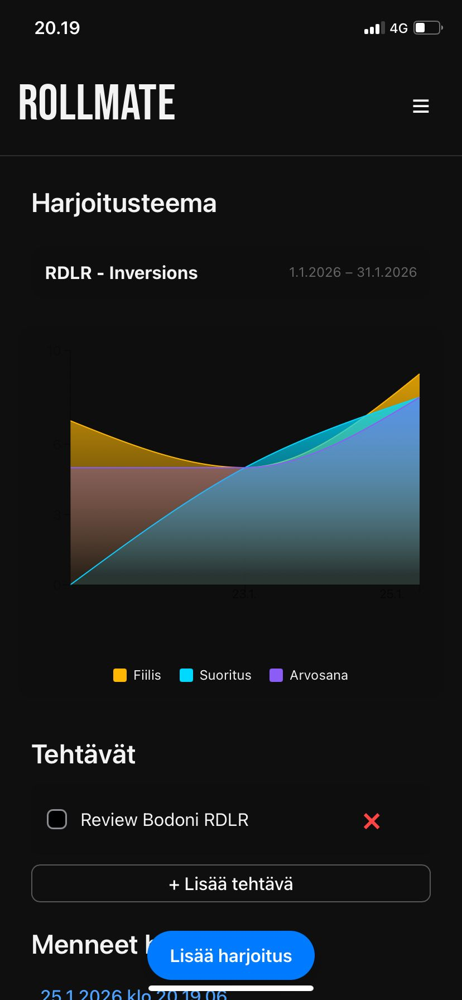

# Rollmate

> A minimal cloud-native training log application built on Azure.

## Contents

- [Project Overview](#project-overview)
- [Architecture Overview](#architecture-overview)
- [Security & Secret Management](#security--secret-management)
- [Infrastructure as Code (Terraform)](#infrastructure-as-code-terraform)
- [MVP Scope and non-goals](#mvp-scope-and-non-goals)
- [CI/CD](#cicd)

## Project overview
Rollmate is a minimal training log application designed for Brazilian Jiu-Jitsu and Submission Grappling.

The application is intended for mobile-first use as a Progressive Web App (PWA) and focuses on structured skill development rather than social or competitive features.

The design follows established principles of skill acquisition in grappling and combat sports, combining structured training themes, actionable session-level tasks, objective load metrics with visual summaries, and subjective feedback from training sessions.

From a technical perspective, Rollmate serves as a demonstration of cloud-native application development, featuring an Azure-hosted REST API, infrastructure provisioned with Terraform, and secure secret management using Managed Identity and Azure Key Vault.

## Architecture Overview
Rollmate is built around a mobile-first client and a REST API hosted on Azure App Service, with infrastructure provisioned using Terraform.

The system consists of a Progressive Web App used on mobile devices and a Node.js backend running on Azure App Service. The client communicates with the backend exclusively over HTTPS. PostgreSQL is used as the persistent data store.

All infrastructure is provisioned using Terraform. Secrets are not stored in source control or plain environment variables; instead, the backend accesses required secrets at runtime using a system-assigned Managed Identity and Azure Key Vault.
Observability is provided through Azure Application Insights.

.jpeg)

## Security & Secret Management
Secrets such as database connection strings and signing keys are stored in Azure Key Vault. The backend application runs with a system-assigned Managed Identity, which is granted permission to read required secrets from the Key Vault at runtime.
No secrets are committed to source control, stored in plain environment variables, or embedded in the application configuration. In Azure App Service, application settings reference Key Vault secrets directly.

## Infrastructure as Code (Terraform)
The Terraform configuration defines:
- Resource Group
- App Service Plan and Linux App Service (Node.js API) with HTTPS-only and system-assigned Managed Identity
- Azure Static Web App (web frontend)
- Azure PostgreSQL Flexible Server, database, and a firewall rule allowing access from Azure services (dev/MVP scope)
- Azure Key Vault (RBAC enabled) and role assignments for:
        the current Terraform principal (admin for managing secrets)
        the Web App Managed Identity (read access to secrets)
- Application Insights and Log Analytics

PostgreSQL administrator credentials are required during infrastructure provisioning but are not used by the application at runtime; the running application accesses the database exclusively via the connection string stored in Azure Key Vault.

## MVP Scope and non-goals
Included:
- Training session tracking
- Session-specific subjective notes/feedback
- Basic objective metrics and visual summaries
- Basic long term theme creation and tracking with short term task possibilities

Out of scope:
- Advanced authentication features (password reset, email verification, account recovery)
- User profile management
- Notifications
- Advanced analytics

The goal of the MVP is to validate architecture, infrastructure, and data flow rather than to build a feature-complete product.

## CI/CD 
Automated CI/CD pipelines are intentionally out of scope for this MVP.
The focus of the project is on cloud architecture, infrastructure provisioning, and secure secret management. The current stack is compatible with GitHub Actions–based deployments if extended in the future.
